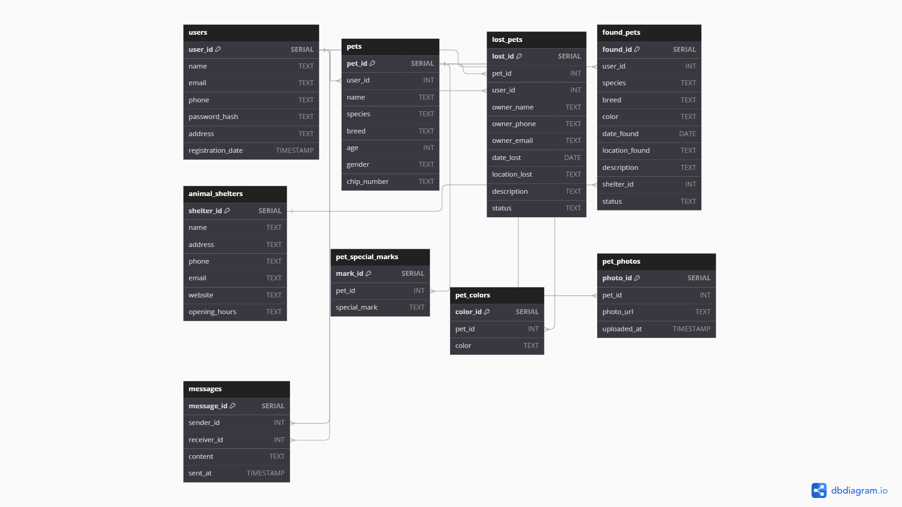

# Find Your Pet

## Описание проекта
**Find Your Pet** — это веб-приложение для поиска потерянных домашних животных. Оно позволяет пользователям регистрироваться, добавлять информацию о своих питомцах, которые пропали, а также просматривать найденных животных. Пользователи могут загружать фотографии, добавлять особые приметы питомцев и получать уведомления о найденных животных.

## Стек используемых технологий

### Бэкенд
- **Java**: Основной язык программирования для написания серверной части.
- **JDBC**: Взаимодействие с базой данных для CRUD операций.
- **PostgreSQL**: Реляционная база данных для хранения данных о пользователях и питомцах.
- **Maven**: Управление зависимостями и сборкой проекта.
- **WebSocket/HTTPClient**: Взаимодействие с клиентом для передачи данных.
- **JSON**: Используется для передачи данных между клиентом и сервером.
- **Логирование**: Для отслеживания событий и ошибок в приложении.
- **bcrypt**: Хэширование паролей для обеспечения безопасности пользователей.

## Роли пользователей и варианты использования

### 1. **Регистрация**
- **Действие**: Пользователь регистрируется, предоставив имя, email, телефон, пароль и адрес.
- **Результат**: Создается учетная запись, и пользователь может войти в систему.

### 2. **Авторизация**
- **Действие**: Пользователь вводит email и пароль для входа.
- **Результат**: Пользователь получает доступ к своему профилю и возможностям приложения.

### 3. **Добавление информации о потерянном питомце**
- **Действие**: Пользователь заполняет форму с информацией о потерянном питомце (имя, особые приметы, цвет, фото).
- **Результат**: Информация сохраняется в базе данных, и другие пользователи могут увидеть ее.

### 4. **Просмотр найденных питомцев**
- **Действие**: Пользователь может просматривать животных, найденных другими пользователями.
- **Результат**: Пользователь может найти своего питомца среди найденных.

### 5. **Обновление информации о питомце**
- **Действие**: Пользователь может обновить информацию о питомце.
- **Результат**: Информация в базе данных обновляется.

### 6. **Удаление информации о питомце**
- **Действие**: Пользователь удаляет информацию о питомце, если он был найден.
- **Результат**: Информация удаляется из базы данных.

### **Диаграмма вариантов использования**

## **Диаграмма базы данных**

